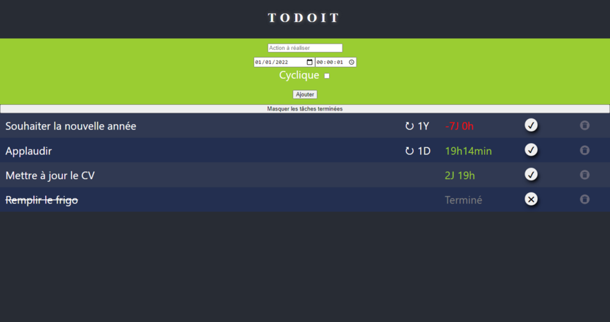

ToDoIt
======

- Frontend with **React**
- Backend with [**Fastify**](https://www.fastify.io/)
- DB with **SQLite**

---

Interractive Todo web application for local usage, with deadlines and repeatable tasks :

*For single user, or collective Todo

- Front code in /src
- Backend in /server

## Launch the Server

### Production

Build files : 
npm run build

Launch server :
node server/server.js

Visit http://localhost:8000

### Dev
Launch server :
node server/server.js

Launch React :
npm run start

Visit http://localhost:3000

---

